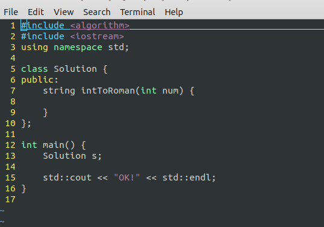

一个shell脚本，&&  一个油猴脚本，方便在本地Linux`环境下刷题(Leetcode)

写这个脚本就是因为，不喜欢力扣网页上的代码编辑器，还是习惯用Linux上的Vim编辑器(虽然网页上也能用vim，但是功能太弱)。

顺便复习以下shell编程的知识，很少写shell脚本，一些基础的都忘了。

## Usage:

1. 进入[力扣中国](https://leetcode-cn.com/)官网的某一题目的页面，点击题目后的copy按钮
2. 终端执行命令：`leetcode init 12.integer-to-roman`，自动创建文件夹和文件并使用vim打开文件(如下文件内容是自动生成的，根据剪贴板中的代码)
3. 在 Solution 类中填写代码，保存退出
4. 在终端输入`leetcode commit` ，即可将Solution类的代码复制到系统剪贴板
5. 回到网页，粘贴，运行，提交

## Alias

```sheell
alias leetcode='source /home/xxx/xxx/xxx/leetcode.sh`
alias lc='source /home/xxx/xxx/xxx/leetcode.sh'
```

注意要使用 `source`，否则脚本中的 `cd` 不会影响当前shell环境

## 所有命令

```shell
# 进入leetcode目录
lc home

# 开始做新的一题：题目编号xx，题目名yy
# 该命令会自动进入leetcode目录，创建xx.yy目录，并进入xx.yy目录，创建文件夹
#  新建一个main.cpp并将剪贴板中的数据(Solution类的定义）写入，以及头文件和一个简单的main函数
lc init xx.yy

## 写完代码，将Solution类的代码复制到剪贴板
# 注意：必须在某一个题目对应的目录中(即main.cpp所在的位置）
lc commit
或者 lc submit
或者 lc c

# 进入题目编号为xx的题目所在的目录
lc cd xx

# 进入题目名称包含yyy的题目所在的目录
lc cd yyy
```


Vim is the best Text Editor !
